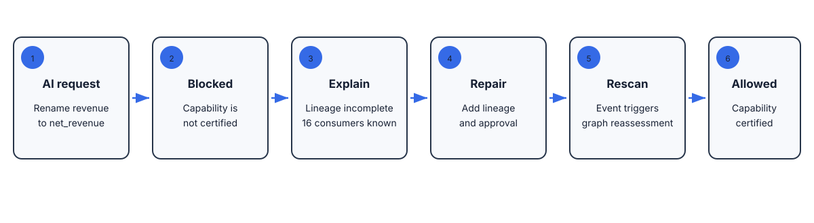

# MetaGate

### DataHub gives AI context. MetaGate gives AI permission.

AI agents should not have to guess whether a dataset is safe to use. MetaGate
turns the metadata already in DataHub into a clear, capability-specific answer:

> **Can this agent perform this action on this asset right now?**

The answer is evidence-backed, explainable, and enforceable: **allowed** or
**blocked**, with the exact reason and a copyable path to repair the gap.



## The wow moment

Open a dataset in DataHub. The MetaGate Chrome extension recognizes the asset
URL and places an AI action decision beside the metadata you are already
looking at.

Then open the full review:

1. MetaGate reads the current DataHub evidence.
2. You request a capability, such as autonomous action or restricted SQL.
3. MetaGate returns **allowed** or **blocked** for that exact asset and action.
4. If blocked, the steward gets a precise repair plan, not a vague score.
5. The protected tool gate fails closed until the evidence is good enough.

That is the product in one sentence:

> **Before AI acts, MetaGate checks the gate.**

## What MetaGate adds to DataHub

DataHub already stores the ingredients of trust. MetaGate turns them into an
action boundary.

| DataHub context | MetaGate decision layer |
| --- | --- |
| Ownership, glossary, lineage | Who owns the risk and what does the asset mean? |
| Assertions, freshness, incidents | Is the evidence current and healthy? |
| Usage, tags, policy metadata | Is this action appropriate for this asset? |
| Agent, skill, tool, service registry | Is the execution path authorized? |

The policy is explicit and capability-specific. A dataset can be safe for
discovery but blocked for modification. A well-governed asset can be allowed
under the same policy that blocks an incomplete one.

## See it in action

| Surface | What it proves |
| --- | --- |
| [MetaGate Review](https://leafy-maamoul-4acf4b.netlify.app/?api=https://metagate-ixz0.onrender.com) | Evidence-first decision, repair plan, audit trail, and policy views |
| [Chrome extension](examples/browser-extension/README.md) | Automatic decision panel on the DataHub asset page currently open in Chrome |
| [MetaGate MCP](examples/mcp/README.md) | Agents can call the same governed evaluation through MCP |
| [DataHub preflight contract](examples/datahub-preflight-action/README.md) | The intended DataHub action and Context Contract shape |
| [Local proof runbook](docs/live-datahub-validation.md) | How to verify the real DataHub-backed path |

The hosted page is explicitly source-labelled. The local proof is the
authoritative demonstration for the connected DataHub run.

## Features worth showing

- Evidence-first **allowed / blocked** decisions for a requested AI action.
- Full connected-catalog discovery; the current local run evaluates 74 datasets,
  not a hard-coded six-asset scope.
- Exact failed terms and evidence facts instead of a black-box score.
- Copyable repair plans with owner, change, and re-check guidance.
- A Chrome extension that injects the decision into the DataHub page.
- A local review API, CLI, Python SDK, Docker path, and browser-side embed
  prototype.
- A fail-closed tool boundary: blocked requests report `tool_not_invoked`.
- Agent Registry and Service Catalog checks for the execution chain.
- A machine-readable Context Contract for agent workflows.
- Optional DataHub MCP comparison, kept separate from the core proof unless it
  is actually configured and verified.
- Explicit read-only defaults and deployment-gated write-back.
- Repair-loop, adversarial, policy, and regression tests.

## Quickstart: local live proof

Install the project and start the review API:

```bash
python3 -m pip install -e ".[dev,datahub]"
./scripts/start_metagate_review.sh
```

Open:

```text
http://127.0.0.1:8765/review
```

The launcher uses the connected DataHub GraphQL endpoint, discovers the whole
catalog, and keeps fixture fallback disabled. Run the doctor before recording:

```bash
metagate-doctor
```

The current local environment is DataHub v1.7.0 at `http://localhost:9002`.
MetaGate's review API is at `http://127.0.0.1:8765`.

The current connected catalog is a blocked-first proof for the high-risk
autonomous action: the local DataHub GraphQL response does not currently expose
enough of the required evidence to produce an allowed live result. The positive
contrast in the video uses the explicitly labelled bundled fixture, or a live
asset only after its metadata has been repaired and re-verified.

## Chrome extension quickstart

The extension is a lightweight browser proof, not a claim of native DataHub
frontend installation. It demonstrates the user experience that matters:
open a DataHub asset and receive a MetaGate decision in context.

```bash
./scripts/package_extension.sh
```

Then in Chrome:

1. Open `chrome://extensions` and enable **Developer mode**.
2. Choose **Load unpacked**.
3. Select `examples/browser-extension`.
4. Open a DataHub dataset page at `http://localhost:9002`.
5. The MetaGate panel appears with the decision, readiness, confidence, a
   compact repair plan, and an Evidence heading. Open MetaGate Review for the
   full evidence and repair plan.

The default API is `http://127.0.0.1:8765`. The extension options page lets you
point it at another private MetaGate API. It stores only that API URL in Chrome;
DataHub credentials stay server-side.

## One API decision

```bash
curl -sG http://127.0.0.1:8765/api/evaluate \
  --data-urlencode 'urn=urn:li:dataset:(urn:li:dataPlatform:hive,fct_users_created,PROD)' \
  --data-urlencode 'capability=autonomous-agent-action' \
  | python3 -m json.tool
```

Typical output is deliberately simple:

```json
{
  "decision": "blocked",
  "capability": "autonomous-agent-action",
  "failed_terms": ["assertions.present"],
  "reason": "Missing required evidence: assertions"
}
```

## DataHub proof and boundaries

The local proof includes a verified REST write-back/read-back for
`SampleHiveDataset` using the `metagate.ai_context_contract` property. That is
local evidence for that path, not proof that every DataHub deployment supports
the same mutation.

The following remain deployment-specific or external dependencies:

- a public live DataHub connection;
- native DataHub plugin installation;
- the separately configured official DataHub MCP server;
- independent human reviewer agreement;
- an upstream DataHub merge.

MetaGate labels these boundaries instead of turning a prototype or planned
integration into a shipped claim.

## Architecture

```text
DataHub metadata
      │
      ▼
Evidence adapter ──► policy + capability check ──► MetaGate Certificate
      │                                      │
      │                                      ├─► agent / tool boundary
      │                                      ├─► repair plan
      │                                      └─► Context Contract + audit
      │
      ├─► Review app
      ├─► Chrome extension
      ├─► MCP server
      └─► DataHub preflight reference
```

## Tests and local validation

```bash
PYTHONPATH=src python3 -m unittest discover -s tests -q
PYTHONPATH=src python3 scripts/evaluate_benchmark.py
```

The test suite validates policy behavior, DataHub evidence extraction,
extension packaging, API contracts, repair flows, enforcement, and release
boundaries. Curated benchmark results are repository-level engineering proof;
they are not a claim of production accuracy or independent human validation.

## Demo materials

- [Three-minute hackathon video script](docs/demo-script.md)
- [Video and screenshot checklist](docs/screenshots-checklist.md)
- [Architecture and proof layers](docs/architecture.md)
- [Why MetaGate](docs/why-metagate.md)
- [Production proof boundaries](docs/production-proof.md)

## License

Apache-2.0. See [LICENSE](LICENSE).
