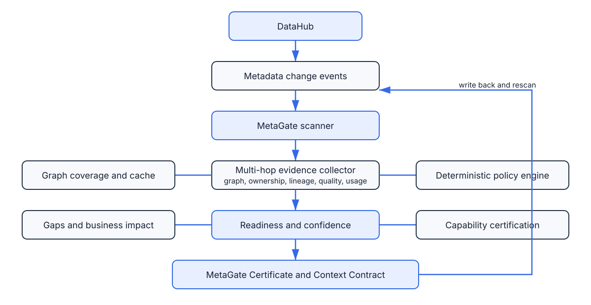

# Predicate

[](pyproject.toml)
[](LICENSE)
[](pyproject.toml)
[](.github/workflows/ci.yml)

**Know when AI is allowed to act.**

Predicate turns DataHub metadata into deterministic go/no-go decisions for AI agents.

It does not make AI smarter. It checks whether the metadata gives an agent enough evidence to safely explain, summarize, modify, or act on a data asset.

## Start Here

**What it is:** Predicate is an AI admission controller for DataHub. It checks whether a requested AI action is allowed for a specific data asset.

**Why it matters:** AI agents should not summarize, transform, or modify enterprise data just because the table exists. They need proof: owner, glossary, lineage, assertions, freshness, incidents, usage, and policy.

**Proof:** This MVP includes a CLI/SDK engine, a live local DataHub GraphQL run, a local API-backed review app, an automatic browser extension prototype for DataHub asset pages, a Dockerized review API path, a sanitized public demo, 18 automated tests, and 30 curated policy conformance checks.

**Static visual demo:** [Predicate Review](https://leafy-maamoul-4acf4b.netlify.app) is a sanitized visual demo of the intended DataHub embedded experience.

**API-backed public fixture demo:** [Predicate Review + Render API](https://leafy-maamoul-4acf4b.netlify.app/?api=https://predicate-ixz0.onrender.com) uses the public Render API with sanitized fixture data. It should show `Mode: public API fixture`.

**Run a live DataHub check:**

```bash
export DATAHUB_GRAPHQL_URL="http://localhost:8080/api/graphql"

PYTHONPATH=src python3 -m predicate.cli \
  "urn:li:dataset:(urn:li:dataPlatform:hive,fct_users_created,PROD)" \
  --policy examples/policies/enterprise_ai.yml \
  --datahub-url "$DATAHUB_GRAPHQL_URL" \
  --request-capability autonomous-agent-action
```

**Open the local review app:**

```bash
PYTHONPATH=src:. python3 scripts/serve_review.py \
  --datahub-url "$DATAHUB_GRAPHQL_URL" \
  --policy examples/policies/enterprise_ai.yml
```

Then open `http://127.0.0.1:8765/review`.

## Judge Notes

What is real in this MVP:

- CLI and SDK decision engine.
- Live reads from a local DataHub GraphQL endpoint.
- Allowed and blocked decisions against real DataHub sample assets.
- Local API-backed Predicate Review app.
- Browser extension prototype that auto-detects a DataHub asset URN and calls Predicate.
- Dockerfile for running the Predicate review API as a private service.
- Tests and curated benchmark suite.
- Safe write-back payloads and receipts.

What is prototype:

- The DataHub embedded panel is an intended embedded experience, not a packaged production DataHub plugin.
- The automatic DataHub page integration is a browser extension prototype, not a packaged production DataHub plugin.
- The public hosted demo is sanitized static proof, not a live DataHub deployment.
- Live write-back mutations are gated because DataHub mutation support differs by deployment.
- The 30/30 benchmark is curated policy conformance, not an independent external benchmark.
- Independent benchmark scoring exists, but reviewers still need to label held-out cases.

## Action predicates

Every AI action is evaluated against metadata-backed conditions.

```json
{
  "action": "autonomous-agent-action",
  "predicate": "ownership.present && lineage.present && assertions.present && incidents.open == 0",
  "result": false,
  "failed_terms": ["assertions.present"],
  "decision": "blocked"
}
```

No metadata proof, no AI action.

## Quick Results

- 30 curated benchmark conformance checks passing
- No unexpected allows or blocks in the curated checks
- 18 automated tests passing
- Installable Python SDK and DataHub Skill reference
- Explainability reports and policy simulation
- Predicate Certificate generation

| Benchmark category | Cases |
| --- | ---: |
| Ready | 6 |
| Missing | 6 |
| Stale | 6 |
| Incomplete | 6 |
| Contradictory | 6 |

For a harder stress test, see [Difficult DataHub Run](docs/difficult-datahub-run.md), which evaluates a finance-critical asset with incomplete glossary, incomplete column lineage, contradictory assertions, stale freshness, and stricter finance thresholds.




## What works in this MVP

- DataHub-style graph traversal through an adapter interface, local fixture client, or live GraphQL client.
- Evidence extraction for ownership, glossary, lineage, assertions, incidents, freshness, usage, and policy.
- Deterministic AI-readiness scoring and confidence scoring.
- Capability-based certification.
- Predicate Certificate output.
- Gap classification as missing, stale, incomplete, or contradictory.
- YAML policy profiles.
- Graph-aware score propagation from upstream and downstream entities.
- Business impact summary and unlock recommendations.
- Context contract generation.
- AI Readiness Diff support.
- Readiness history and event-to-diff processing.
- Write-back adapter for certificates and remediation tasks.
- Event-driven background scanner API.
- Installable DataHub Skill/plugin reference in `examples/datahub-ai-readiness-skill`.
- Tests, examples, CI, contribution guide, license, and architecture docs.
- Release metadata, changelog, public-demo runbook, and an upstream-ready contribution bundle.
- Explainability reports, policy simulation, audit logging, scan timing, and a labeled benchmark.

## Submission Package

Judges may review the repository without running it. The fastest path is:

- [Static visual demo](https://leafy-maamoul-4acf4b.netlify.app)
- [API-backed public fixture demo](https://leafy-maamoul-4acf4b.netlify.app/?api=https://predicate-ixz0.onrender.com)
- [Public API Fixture Demo](docs/public-live-demo.md)
- [Live Predicate Review App](docs/live-review-app.md)
- [Browser Extension Prototype](examples/browser-extension/README.md)
- [Production Gap Closure](docs/production-gap-closure.md)
- [Difficult DataHub Run](docs/difficult-datahub-run.md)
- [Devpost submission draft](docs/devpost-submission-draft.md)
- [Judge proof](docs/judge-proof.md)
- [3-minute demo script](docs/demo-script.md)
- [Good first issues](GOOD_FIRST_ISSUES.md)
- [Submission checklist](docs/submission-checklist.md)
- [Screenshots checklist](docs/screenshots-checklist.md)
- [Release checklist and v0.1.0 notes](docs/release-checklist.md)
- [PyPI publication checklist](docs/pypi-publication-checklist.md)
- [Real DataHub validation checklist](docs/live-datahub-validation.md)
- [Hosted Demo Plan](docs/hosting-plan.md)
- [Live Write-back Screenshot](docs/live-writeback-screenshot.md)
- [Upstream DataHub PR template](docs/upstream-datahub-pr-template.md)
- [Future work](docs/future-work.md)
- [Examples index](examples/README.md)

## Live DataHub mode

The package includes a configurable GraphQL client. Set `DATAHUB_GRAPHQL_URL` and `DATAHUB_TOKEN`, then run without `--datahub-file`:

```bash
predicate "urn:li:dataset:(urn:li:dataPlatform:snowflake,analytics.revenue_daily,PROD)" \
  --policy examples/policies/enterprise_ai.yml \
  --datahub-url "$DATAHUB_GRAPHQL_URL"
```

Write-back mutations remain deployment-specific. Set `DATAHUB_CERTIFICATE_MUTATION` and `DATAHUB_TASK_MUTATION` to the GraphQL mutation documents supported by your DataHub version. The client is deliberately conservative when these are unset.

### Live DataHub proof

Predicate was validated against a local DataHub quickstart seeded with sample
metadata. The same policy produced different outcomes for different DataHub
assets:

| DataHub asset | Capability | Decision | Evidence |
| --- | --- | --- | --- |
| `urn:li:dataset:(urn:li:dataPlatform:hive,SampleHiveDataset,PROD)` | `autonomous-agent-action` | allowed | Required evidence present |
| `urn:li:dataset:(urn:li:dataPlatform:hive,fct_users_created,PROD)` | `autonomous-agent-action` | blocked | Missing assertions, score below threshold, confidence below threshold |
| `urn:li:dataset:(urn:li:dataPlatform:hive,fct_users_deleted,PROD)` | `autonomous-agent-action` | blocked | Missing assertions, score below threshold, confidence below threshold |

Some DataHub GraphQL versions require dataset fields to be queried through a
Dataset fragment. If the default query reports `FieldUndefined` on `Entity`,
set `DATAHUB_ENTITY_QUERY` to a deployment-compatible query such as:

```graphql
query PredicateEntity($urn: String!) {
  entity(urn: $urn) {
    urn
    type
    ... on Dataset {
      editableProperties { description }
      ownership { owners { owner { ... on CorpUser { urn } } } }
      glossaryTerms { terms { term { urn } } }
      domain { domain { urn } }
      tags { tags { tag { urn } } }
      assertions { assertions { urn } }
      incidents { incidents { urn } }
    }
  }
}
```

## Try it

```bash
python -m pip install -e ".[dev]"
predicate \
  "urn:li:dataset:(urn:li:dataPlatform:snowflake,analytics.revenue_daily,PROD)" \
  --policy examples/policies/enterprise_ai.yml \
  --datahub-file examples/data/datahub_graph.json
```

## SDK usage

```python
from context_gradient import ReadinessEngine, load_policy
from context_gradient.datahub.adapter import DataHubEvidenceExtractor
from context_gradient.datahub.mock_client import FileDataHubClient

policy = load_policy("examples/policies/enterprise_ai.yml")
client = FileDataHubClient("examples/data/datahub_graph.json")
bundle = DataHubEvidenceExtractor(client).bundle("urn:li:dataset:(urn:li:dataPlatform:snowflake,analytics.revenue_daily,PROD)")
certificate = ReadinessEngine(policy).certify(bundle)
print(certificate.as_dict())
```

The public demo and contribution workflow are documented in
`docs/public-demo-runbook.md` and `contrib/datahub-example/README.md`.
Representative local outputs are in `examples/outputs/`; the final demo script
is in `docs/demo-script.md`.

Representative outputs:

- [Predicate Certificate](examples/outputs/certificate.json)
- [Action Predicate](examples/outputs/action-predicate.json)
- [Allowed Action](examples/outputs/allowed-action.json)
- [Blocked Action](examples/outputs/blocked-action.json)
- [Live DataHub Proof](examples/outputs/live-datahub-proof.html)
- [Interactive Demo App](examples/outputs/predicate-demo-app.html)
- [Static Public Demo Entry](public-demo/index.html)
- [Before/After Repair](examples/outputs/before-after-repair.json)
- [Write-back Proof](examples/outputs/writeback-proof.json)
- [Write-back Receipt](examples/outputs/writeback-receipt.json)
- [Context Contract](examples/outputs/context-contract.json)
- [Explainability Report](examples/outputs/explainability-report.json)
- [Readiness Diff](examples/outputs/readiness-diff.json)
- [Policy Simulation](examples/outputs/policy-simulation.json)
- [Write-back payload](examples/outputs/writeback-payload.json)

Adoption and judging context:

- [Capability Matrix](docs/capability-matrix.md)
- [Trust Timeline](docs/trust-timeline.md)
- [Capability Diff](docs/capability-diff.md)
- [Policy Catalog](docs/policy-catalog.md)
- [Scoring and Calibration](docs/scoring-calibration.md)
- [Independent Benchmark Protocol](docs/independent-benchmark-protocol.md)
- [Independent Evaluation](docs/independent-evaluation.md)
- [Write-back Safety](docs/writeback-safety.md)
- [Why Predicate?](docs/why-predicate.md)
- [FAQ](docs/faq.md)
- [Design Principles](docs/design-principles.md)

Run the measured curated benchmark with `PYTHONPATH=src python3 scripts/evaluate_benchmark.py`.
Score independently labeled cases with
`PYTHONPATH=src python3 scripts/evaluate_independent_labels.py --labels examples/benchmark/independent-label-template.csv`.
Use `--explain` for an evidence-to-policy-to-decision report, and see
`docs/live-datahub-validation.md` before connecting a real deployment.

Record live DataHub decisions and regenerate the visual proof page:

```bash
predicate "urn:li:dataset:(urn:li:dataPlatform:hive,SampleHiveDataset,PROD)" \
  --policy examples/policies/enterprise_ai.yml \
  --datahub-url "$DATAHUB_GRAPHQL_URL" \
  --request-capability autonomous-agent-action \
  --record-live-run

PYTHONPATH=src python3 scripts/render_live_proof.py
open examples/outputs/live-datahub-proof.html
```

Run the browser review app backed by a local Predicate API:

```bash
PYTHONPATH=src python3 scripts/serve_review.py \
  --datahub-url "$DATAHUB_GRAPHQL_URL" \
  --policy examples/policies/enterprise_ai.yml
```

Then open `http://127.0.0.1:8765/review`.

Benchmark wording: Predicate passes all 30 curated conformance checks
across ready, missing, stale, incomplete, and contradictory metadata states.
Those checks validate the policy behavior implemented in this repository; they
are not a production accuracy, precision, or recall claim.
