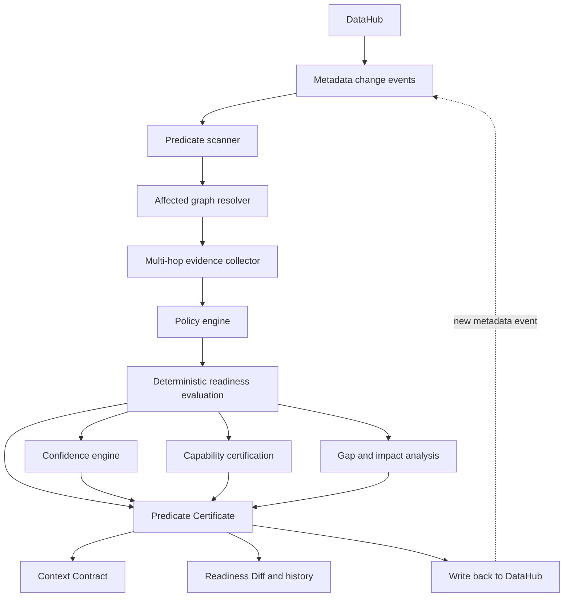

# Architecture

**Predicate helps teams know when AI is allowed to act.**

## Components

- `ReadinessEngine`: deterministic scoring, confidence, gap classification, capability certification, recommendations, and context contracts.
- `PolicyProfile`: YAML policy-as-code controlling evidence weights, stale thresholds, capability gates, and graph propagation.
- `DataHubEvidenceExtractor`: maps DataHub metadata into SDK evidence.
- `BackgroundScanner`: handles event-driven rescans for changed entity URNs.
- `DataHubWriteback`: publishes certificates and remediation tasks through a client adapter.
- `ReadinessHistory`: stores issued certificates for audit and diffing.

## Live DataHub wiring

Implement `DataHubClient` with:

- `get_entity`: fetch ownership, glossary terms, lineage, assertions, incidents, freshness, usage statistics, and policy tags/aspects.
- `get_neighbors`: fetch upstream and downstream nodes for graph propagation.
- `write_certificate`: write an AI readiness custom aspect or equivalent assertion.
- `create_remediation_task`: create tasks or incidents for missing controls.
